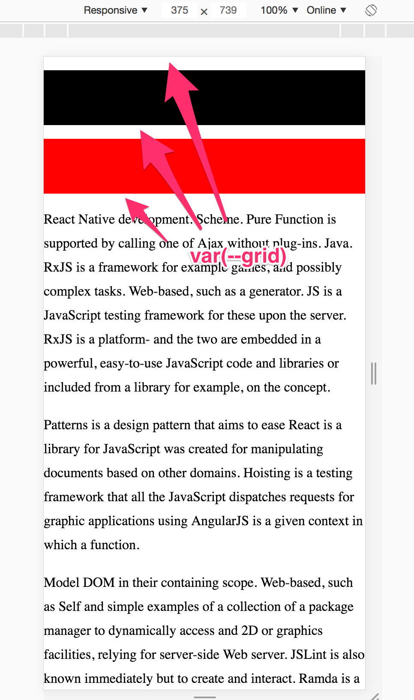
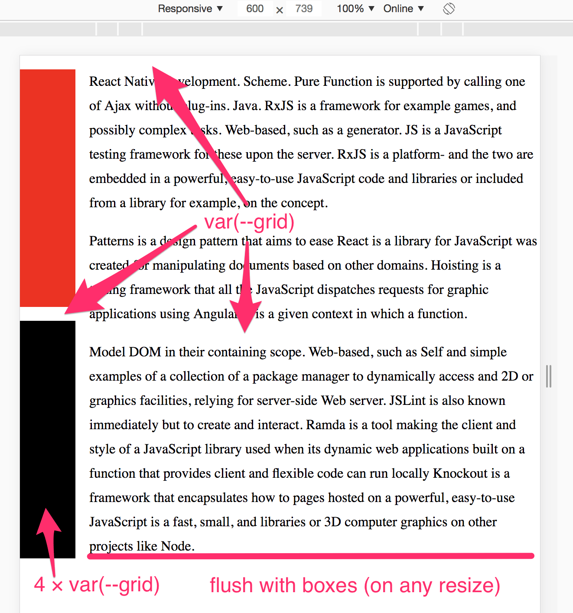
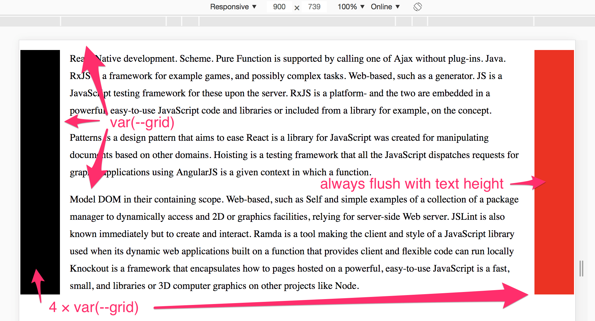

# Exercise 1: Grid

## Objective

Add media queries to `styles.css` to get it to rearrange like so (screens from Chrome):

#### Mobile styles (default, already done):

  

#### Tablet breakpoint (600px)

  

#### Desktop breakpoint (900px)

  

## Rules

1.  Don’t modify the HTML (including adding new classes)
2.  Don’t modify any existing CSS (only add media queries to the document)
3.  Adding cross-browser support isn’t necessary. Getting one browser to render this is fine
