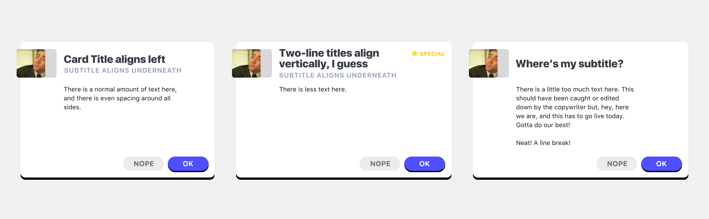

# Exercise 2: Fluidity

## Objective

Mark up and style the following three-card layout:

<p align="center">
  
</p>

You can use the existing `index.html` and `styles.css` to complete this.

#### Assets

* The only asset you need should be this star: .
* The thumbnail can be generated from any placeholder service such as https://placecage.com.
* In case you don’t want to type the paragraphs, you can copy the following:

```
There is a normal amount of text here, and there is even spacing around all sides.

There is less text here.

There is a little too much text here. This should have been caught or edited down by the copywriter but, hey, here we are, and this has to go live today. Gotta do our best!

Neat! A line break!
```

## Rules

1.  The **rows** (not cards) should be equal height.
2.  In any given row, there shouldn’t be extra space between the tallest body text and the buttons below.
3.  The cards should stack vertically (1-up or 2-up) at reasonable sizes
4.  Buttons should always be at bottom, aligned right
5.  The minimum spacing between items should be consistent units
6.  Cards **don’t** have to rearrage by breakpoint
7.  Exact colors & font attributes don’t have to match the mockup.
