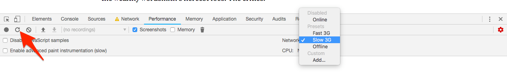

# Exercise 4: Rendering

Your art director is in love with fonts and large images! Unfortunately, this
editorial piece loads really slowly on bad connections.

In Chrome’s **Performance** tab, throttle your network to **Slow 3G** and click
the refresh button near the left. The text is invisible for over 3 seconds,
and the image pushes the page down as it loads.

## Instructions

1.  Have the text showing in < 1 second, even if it isn’t the right font
2.  Prevent the image from making the whole page jump as it loads

## Rules

1.  Only modify `styles.css`
1.  No changing fonts
1.  No changing images
