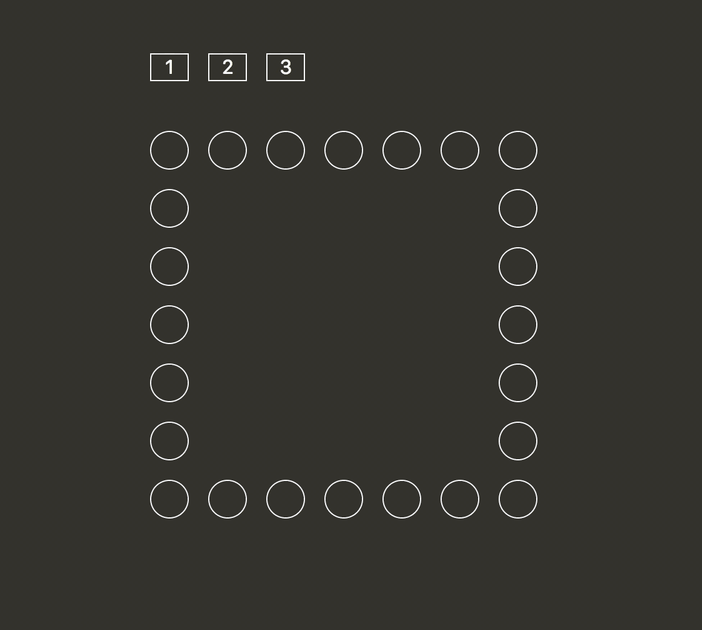

# Example 6: `nth` selectors

## Instructions

Using CSS selectors, add `:hover` styles to the buttons in the example to
recreate the following animation:

## Rules

1.  No JavaScript
2.  Only 3 total selectors are allowed (one per button)
