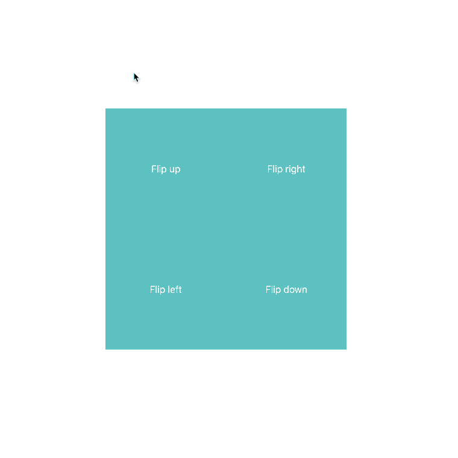

# Exercise 7: Flipping cool

Orchestrate the following cards so that they behave like so on `:hover`, using only CSS.

  

## Rules

1.  The “flip up” card must flip up on its top edge, the “flip right” on its right edge, etc.
2.  Only CSS may be used
3.  The animation must be in 3D perspective
4.  The animation should stop at its current point & reverse if un-hovered before it completed.
