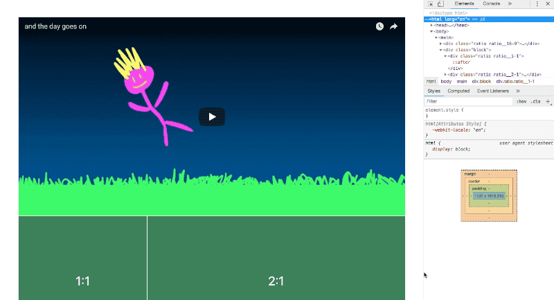

# Exercise 8: Ratios

Preserve the following aspect ratios responsively, with no media queries.

  

### Rules

1.  No media queries.
2.  CSS only.
3.  Each item should derive its ratio from only 1 line of CSS.

_[Hint](https://css-tricks.com/aspect-ratios-grid-items/)_
